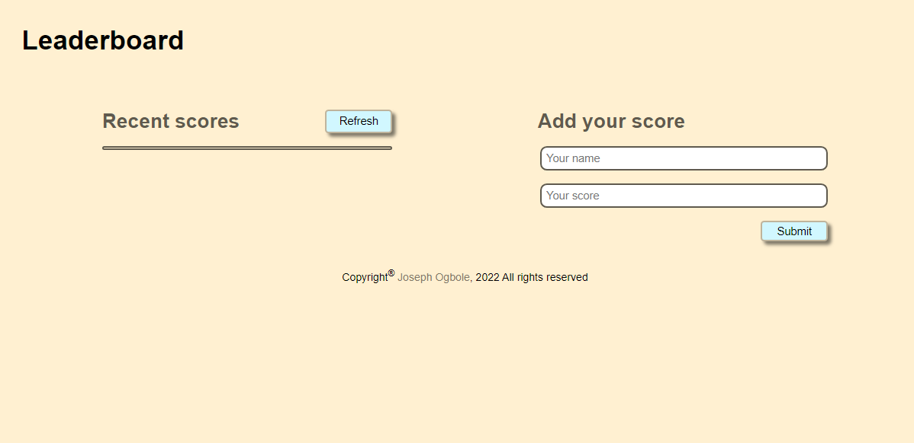

# Leaderboard

# ONJoseph Leaderboard project

> JavaScript leaderboard project using API.

## Description

In this activity I will set up a JavaScript project for the Leaderboard list app, using webpack and ES6 features, notably modules. I should develop a first working version of the app following a wire frame, but without styling - just focus on functionality. In following activities, I will consume the Leaderboard API using JavaScript async and await and add some styling.

## Instructions:

### Phase 1, setup project

- [x] Use [Gitflow](https://github.com/microverseinc/curriculum-transversal-skills/blob/main/git-github/articles/gitflow.md)
- [x] Create an npm project with [webpack](https://webpack.js.org/guides/output-management/#setting-up-htmlwebpackplugin)
- [x] Write plain HTML markup with minimum styling (just to make the layout), because you will implement styles in the following steps
- [x] Don't make API calls (you'll do it in a following lesson).
- [x] Use ES6 modules, with import and export.

### Phase 2, hit the API

- [x] Read the Leader board API documentation to learn how to use this API.
- [x] Create a new game with the name of your choice by using the API.
- [x] Implement the "Refresh" button (receiving data from the API and parsing the JSON).
- [x] Implement the form "Submit" button (sending data to the API).
- [x] Use `async` and `await` JavaScript features to consume the API.
- [x] No styling is required.

### Phase 3, final touches

- At this point I should have a fully working app that uses only basic styles to make the layout work, according to this wire frame shown above.
- Now you should improve the look and feel of the application, adding the styles of your choice.
- Please keep the general layout of the wire frame, this is the only mandatory requirement.
- You can use plain CSS or any CSS framework, it's up to you.

## Built With

- Major languages: HTML, CSS, JS
- Frameworks: none
- Technologies used: Git, webpack, API

## Live Demo

- [Live Demo](https://onjoseph.github.io/Leaderboard/dist/)
## Getting Started

To get a local copy up and running follow these simple example steps.

### Prerequisites

- Internet connection and browser
- A text editor(preferably Visual Studio Code)
- Browser

### Setup

- No setup required

### Install

- [Git](https://git-scm.com/downloads)
- [Node](https://nodejs.org/en/download/)

### Usage

- Clone the repository using `git clone https://github.com/ONJoseph/Leaderboard.git`
- Change directory into the project folder `cd Leaderboard`
- Run `npm install` from the terminal
- Run `npm start` from the terminal
- A new browser will open automatically with application loaded

### Run tests

- N/A

### Deployment

- All the files necessary for deployment are in the /dist folder

## Authors

👤 **Joseph Ogbole**

- GitHub: [@ONJoseph](https://github.com/ONJoseph)
- Twitter: [@ONJCodes](https://twitter.com/ONJCodes)
- LinkedIn: [LinkedIn](https://www.linkedin.com/in/o-n-joseph-ba8425147/)

## 🤝 Contributing

Contributions, issues, and feature requests are welcome!

Feel free to check the [issues page](https://github.com/ONJoseph/Leaderboard/issues).

## Show your support

Give a ⭐️ if you like this project!

## Acknowledgments

## 📝 License

This project is [MIT](./license.md) licensed.
